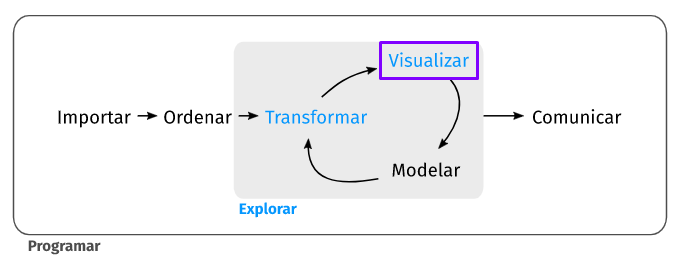
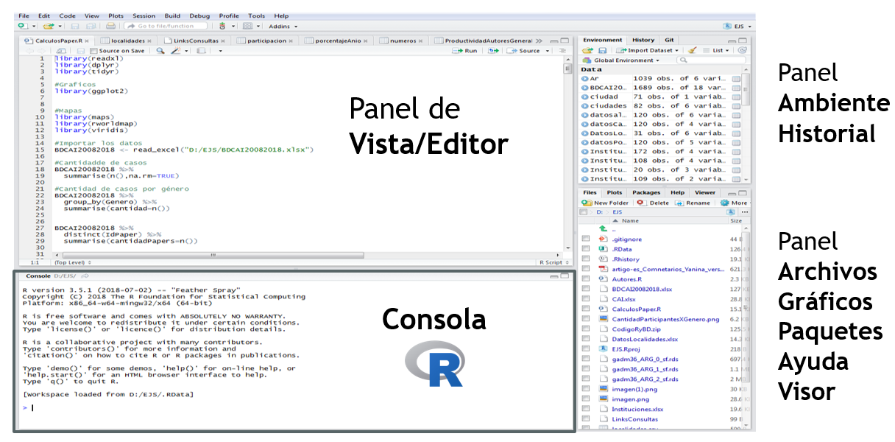
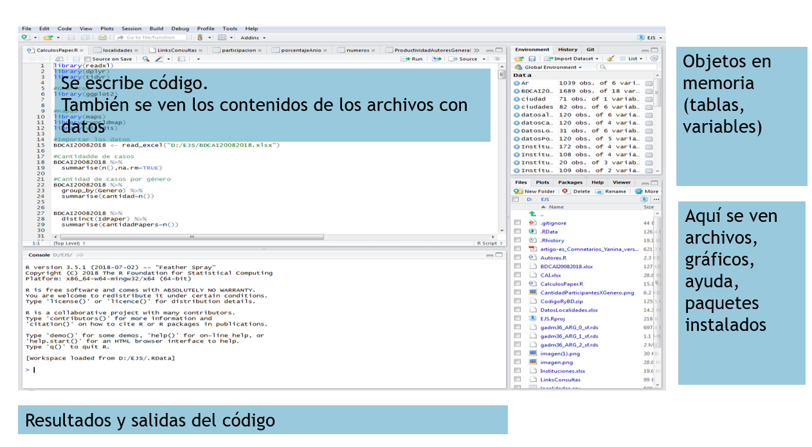
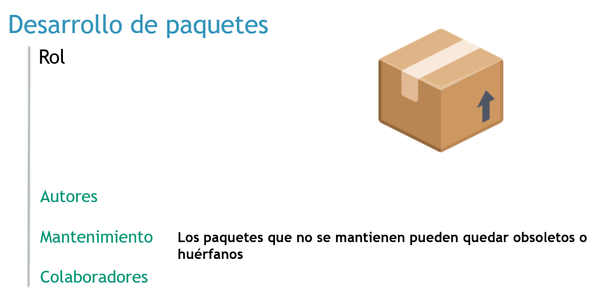

---
output:
  xaringan::moon_reader:
    lib_dir: libs
    css:  ["default", "default-fonts", "animate.css",  "hygge"]
    nature:
      highlightStyle: github
      highlightLines: true
      highlightSpans: true
      countIncrementalSlides: true
---

class: inverse, center

```{r , message=FALSE, warning=FALSE, include=FALSE} 
library(fontawesome)
library(emo)
library(tidyverse)
library(datos)
library(knitr)
```

# `r fa("r-project", fill = 'steelblue')`  para análisis de datos <br> <br> 

## `Introducción a R` <br> <br> <br> 

.large[Roxana N. Villafañe | LEMyP | <a href='http://twitter.com/data_datum'>`r fa("twitter", fill = 'steelblue')` @data_datum</a>] <br> 
.large[Florencia D'Andrea | INTA-CONICET | <a href="http://twitter.com/cantoflor_87"> `r fa("twitter", fill = 'steelblue')` @cantoflor_87</a><br>] 


<br><br><br><br><br> Slides disponibles en <https://bit.ly/curso-r-fca> `r emo::ji("sparkles")`
<br> Página web del curso en <https://curso-r-fca.netlify.com> `r emo::ji("star2")`


---

# Exploración de datos

```{r visu, echo=FALSE, fig.align = "center"}

```

.footnote[**Fuente**: https://es.r4ds.hadley.nz/explorar-introduccion.html]
---

class: center, middle

# Configuracion

```{r on, echo=FALSE, out.width = "600px", fig.align = "center"}
knitr::include_graphics("1_modoon.png")
```


---

# Licencia


---

# Obteniendo Datos


**Campo**
Obtención de datos a campo – Planillas
_Ej: Planilla con valores de presencia – ausencia de especies_


**Laboratorio**
Procesamiento de muestras de experimentos – Mediciones
_Ej: Planilla con valores de mediciones enzimáticas._


**Bases de datos**
Trabajo sobre datos ya obtenidos
_Ej: Datos de estaciones meteorológicas._

---


class: center, middle, inverse

# ¿Por qué programar?

---

class: center, middle

Cuando un trabajo se hace a manualmente, el tiempo empleado para realizar un trabajo suele ser directamente proporcional a la cantidad de trabajo


```{r graf, echo=FALSE, out.width = "600px", fig.align = "center"}
knitr::include_graphics("2_graf.png")
```

.footnote[http://mclibre.org/consultar/python/otros/lenguajes-programacion.html
]
---

class: center, middle

```{r graf2, echo=FALSE, out.width = "600px", fig.align = "center"}
knitr::include_graphics("3_graf.png")
```

.footnote[http://mclibre.org/consultar/python/otros/lenguajes-programacion.html
]

---

class: center, middle

Al final, el informático puede hacer más trabajo sin necesidad de invertir más tiempo, mientras que el no informático descubre que no puede competir.


```{r graf3, echo=FALSE, out.width = "600px", fig.align = "center"}
knitr::include_graphics("3_graf.png")
```

.footnote[http://mclibre.org/consultar/python/otros/lenguajes-programacion.html
]

---

class: center, middle, inverse
# La programación nos permite *automatizar* tareas

---

class: center, middle, inverse
## Nos permite manejar bases de datos más grandes

## Los paquetes permiten explorar varias funcionalidades de forma relativamente sencilla

---

class: center, middle, inverse

## Múltiples formas de comunicar resultados: 
#### con R podes crear reportes en distintos formatos, paginas web, mapas, gráficos, libros, posters, presentaciones, etc..

## Es software libre

---
class: center, middle

```{r 5_r, echo=FALSE, out.width = "900px", fig.align = "center"}
knitr::include_graphics("5_r.png")
```

---
background-image: url(6_r.png)
background-size: contain
class: center, middle

---

class: center, middle

background-size: contain
background-image: url(7_r.png)

---
class: center, middle, inverse
R y RStudio

---

```{r 8_r, echo=FALSE, out.width = "900px", fig.align = "center"}
knitr::include_graphics("8_r.png")
```

---

En nuestra máquina, se presentan dos íconos


```{r 9_r, echo=FALSE, out.width = "900px", fig.align = "center"}
knitr::include_graphics("9_r.png")
```

---


Para instalar R y R-Studio pueden usar el link que esta en la página del curso.

Cuando lo instalamos en nuestra máquina, se presentan dos íconos


```{r 10_r, echo=FALSE, out.width = "600px", fig.align = "center"}
knitr::include_graphics("10_r.png")
```


---
class: center, middle, inverse
# RStudio IDE


---

```{r 12_rstudio2, echo=FALSE, out.width = "800px", fig.align = "center"}



```


---

```{r 13_rstudio, echo=FALSE, out.width = "800px", fig.align = "center"}



```

---
class: center, middle, inverse
# Paquetes

---

# Paquetes

```{r 14_paq, echo=FALSE, out.width = "800px", fig.align = "center"}

knitr::include_graphics("14_paq.png")

```

---

# Funciones

```{r funciones, echo=FALSE, out.width = "800px", fig.align = "center"}

knitr::include_graphics("funciones.png")

```


---

# ¿Cuál es la diferencia entre un paquete y una libreria?

```{r 15_paq, echo=FALSE, out.width = "800px", fig.align = "center"}

knitr::include_graphics("15_paquete.png")

```


---

# ¿Cuál es la diferencia entre un paquete y una libreria?

```{r 16_paq, echo=FALSE, out.width = "800px", fig.align = "center"}

knitr::include_graphics("16_lib.png")

```


---

```{r 17_paq, echo=FALSE, out.width = "800px", fig.align = "center"}



```

---

```{r 18_vigne, echo=FALSE, out.width = "800px", fig.align = "center"}

knitr::include_graphics("18_vigne")

```

---

```{r 19_repo, echo=FALSE, out.width = "800px", fig.align = "center"}

knitr::include_graphics("19_repo")

```

---

```{r 20_dede, echo=FALSE, out.width = "800px", fig.align = "center"}

knitr::include_graphics("20_dede.png")

```

---

background-image: url(21_pro.png)
background-size: contain

---

background-image: url(22_pro.png)
background-size: contain

---
class: center, middle, inverse

# DEMO 1

 Diferencia entre R y RStudio
 Abrir un proyecto de trabajo 
 Instalar y llamar un paquete en R

---

# Mensajes en R

### Errores:
Aparecerá  “Error in…” y tratará de explicar qué fue lo que salió mal. 
Generalmente cuando hay un error, el código no se ejecutará. 

### Advertencias:
Aparecerá  "Warning" y tratará de explicar por qué hay una advertencia.
En general, el código seguirá funcionando, pero hay algo a revisar o estar atentos. 

### Mensajes: 
Cuando el texto en rojo no comienza con "Error in" o «Warning mensaje amistoso. 
Son mensajes de diagnóstico útiles y no impiden que el código funcione.

---

background-image: url(24horst.png)
background-size: contain

---

background-image: url(25_google.png)
background-size: contain

---

background-image: url(26_comm.png)
background-size: contain

---

background-image: url(27_stack.png)
background-size: contain

---


```{r 28_tw, echo=FALSE, out.width = "800px", fig.align = "center"}

knitr::include_graphics("28_twitter.png")

```

---

# Avanza muy rapido

```{r 29, echo=FALSE, out.width = "300px", fig.align = "center"}

knitr::include_graphics("cran.png")

```

---

# La comunidad de R es twittera

```{r 30, echo=FALSE, out.width = "300px", fig.align = "center"}

knitr::include_graphics("twit.png")

```

---

class: center, middle, inverse

# Tidyverse

---

background-image: url(29_ti.png)
background-size: contain

---

background-image: url(30_ti.png)
background-size: contain

---

background-image: url(31_ti.png)
background-size: contain

---

background-image: url(32_ti.png)
background-size: contain

---


background-image: url(33_gg.png)
background-size: contain

---

background-image: url(34_gg.png)
background-size: contain

---

background-image: url(35_sinta.png)
background-size: contain

---

background-image: url(36_sinta.png)
background-size: contain

---

background-image: url(37_ti.png)
background-size: contain

---

background-image: url(38_ti.png)
background-size: contain

---

background-image: url(39_ti.png)
background-size: contain

Tidyverse y R base pueden coincidir / falta slide de roxy
---


# Los paquetes del tidyverse se escriben diferente, tienen una **sintaxis** particular

---

background-image: url(40_synt.png)
background-size: contain

---

background-image: url(41_pipes.png)
background-size: contain

---

background-image: url(42_pipes.png)
background-size: contain

---

background-image: url(43_entonces.png)
background-size: contain

---
class: center, middle, inverse
# Importar datos

---

background-image: url(44_import.png)
background-size: contain

---

# Vector

```{r 45, echo=FALSE, out.width = "800px", fig.align = "center"}

knitr::include_graphics("45_vector.png")

```

---

# dataframe

```{r 46, echo=FALSE, out.width = "800px", fig.align = "center"}

knitr::include_graphics("46_df.png")

```

---

# dataframe

```{r 47, echo=FALSE, out.width = "800px", fig.align = "center"}

knitr::include_graphics("47_df.png")

```

---

# Importar archivos desde Excel

```{r 48, echo=FALSE, out.width = "600px", fig.align = "center"}

knitr::include_graphics("48_readr.png")

```

---

# Otros paquetes

```{r 49, echo=FALSE, out.width = "600px", fig.align = "center"}

knitr::include_graphics("49_dt.png")

```


---

class: center, middle, inverse

# DEMO 2

 Escritura Paquete::funcion()
 Importar una base de datos
 Escribir con pipes


---

# `r emo::ji("raising_hand")` ¿Preguntas?


