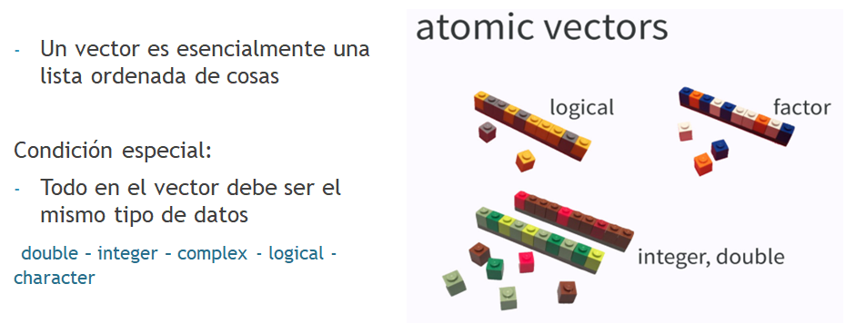

---
output:
  xaringan::moon_reader:
    lib_dir: libs
    css:  ["default", "default-fonts", "animate.css",  "hygge"]
    nature:
      highlightStyle: github
      highlightLines: true
      highlightSpans: true
      countIncrementalSlides: true
---

class: inverse, center

```{r , message=FALSE, warning=FALSE, include=FALSE} 
library(fontawesome)
library(emo)
library(tidyverse)
library(datos)
library(knitr)
```

# `r fa("r-project", fill = 'steelblue')`  para análisis de datos <br> <br> 

## `Introducción a R` <br> <br> <br> 

.large[Roxana N. Villafañe | LEMyP | <a href='http://twitter.com/data_datum'>`r fa("twitter", fill = 'steelblue')` @data_datum</a>] <br> 
.large[Florencia D'Andrea | INTA-CONICET | <a href="http://twitter.com/cantoflor_87"> `r fa("twitter", fill = 'steelblue')` @cantoflor_87</a><br>] 


<br><br><br><br><br> Slides disponibles en <https://bit.ly/curso-r-fca> `r emo::ji("sparkles")`
<br> Página web del curso en <https://curso-r-fca.netlify.com> `r emo::ji("star2")`

---

class: center, middle

# Nota

Las filminas del primer dia de clase se basan en el curso que se dio en 2019 en la JAIIO
https://flor14.github.io/r_cai_2019/

---

class: center, middle

# Configuración

```{r on, echo=FALSE, out.width = "600px", fig.align = "center"}

```

---

# Obteniendo Datos

**Campo**

Obtención de datos a campo – Planillas
_Ej: Planilla con valores de presencia – ausencia de especies_


**Laboratorio**

Procesamiento de muestras de experimentos. Mediciones. 
_Ej: Planilla con valores de mediciones enzimáticas._


**Bases de datos**

Trabajo sobre datos ya obtenidos
_Ej: Datos de estaciones meteorológicas._


```{r muestra, echo=FALSE, out.width = "300px", fig.align = "center"}

```

---


background-image: url(cajanegra.png)
background-size: contain
---
class: center, middle

# Ciencia de Datos

```{r cajanegra2, echo=FALSE, out.width = "800px", fig.align = "center"}

```

.footnote[**Fuente**: https://es.r4ds.hadley.nz/explorar-introduccion.html]
---

class: center, middle, inverse

# ¿Por qué programar?

---

class: center, middle

Cuando un trabajo se hace a manualmente, el tiempo empleado para realizar un trabajo suele ser directamente proporcional a la cantidad de trabajo


```{r graf, echo=FALSE, out.width = "600px", fig.align = "center"}

```

.footnote[http://mclibre.org/consultar/python/otros/lenguajes-programacion.html
]
---

class: center, middle

```{r graf2, echo=FALSE, out.width = "600px", fig.align = "center"}
knitr::include_graphics("3_graf.png")
```

.footnote[http://mclibre.org/consultar/python/otros/lenguajes-programacion.html
]

---

class: center, middle

Al final, el informático puede hacer más trabajo sin necesidad de invertir más tiempo, mientras que el no informático descubre que no puede competir.


```{r graf3, echo=FALSE, out.width = "600px", fig.align = "center"}
knitr::include_graphics("3_graf.png")
```

.footnote[http://mclibre.org/consultar/python/otros/lenguajes-programacion.html
]

---

class: center, middle, inverse
# La programación nos permite <span style="color:blue">automatizar</span> tareas

---

class: center, middle, inverse
## Nos permite manejar <span style="color:blue">bases de datos más grandes</span>. 

## Los <span style="color:blue">paquetes</span> permiten explorar varias funcionalidades de forma relativamente sencilla.

---

class: center, middle, inverse

## <span style="color:blue">Múltiples formas de comunicar resultados</span>: 
### con R podes crear reportes en distintos formatos, paginas web, mapas, gráficos, libros, posters, presentaciones, etc...

## Es software <span style="color:blue">libre</span> 🕊️

---
class: center, middle

```{r 5_r, echo=FALSE, out.width = "900px", fig.align = "center"}

```

---
background-image: url(6_r.png)
background-size: contain
class: center, middle

---

class: center, middle

background-size: contain
background-image: url(7_r.png)


.footnote[https://rss.onlinelibrary.wiley.com/doi/10.1111/j.1740-9713.2018.01169.x]

---

class: center, middle, inverse

# R y RStudio IDE

---
class: center, middle

```{r 8_r, echo=FALSE, out.width = "900px", fig.align = "center"}
knitr::include_graphics("8_r.png")
```

---

class: center, middle

En nuestra máquina, se presentan dos íconos


```{r 9_r, echo=FALSE, out.width = "900px", fig.align = "center"}
knitr::include_graphics("9_r.png")
```

---

class: center, middle

Para instalar R y R-Studio pueden usar el link que esta en la página del curso.

Cuando lo instalamos en nuestra máquina, se presentan dos íconos


```{r 10_r, echo=FALSE, out.width = "600px", fig.align = "center"}
knitr::include_graphics("10_r.png")
```


---
class: center, middle, inverse


# R y <span style="color:blue">RStudio IDE</span>

---

background-image: url(13_rstudio.png)
background-size: contain

---

background-image: url(13_rstudio.png)
background-size: contain

---
class: center, middle, inverse
# Paquetes 📦

---

# Paquetes 📦

```{r 14_paq, echo=FALSE, out.width = "800px", fig.align = "center"}


```

---

# Funciones

```{r funciones, echo=FALSE, out.width = "800px", fig.align = "center"}


```


---

# ¿Cuál es la diferencia entre un paquete y una libreria?

```{r 15_paq, echo=FALSE, out.width = "800px", fig.align = "center"}

knitr::include_graphics("15_paquete.png")

```


---

# ¿Cuál es la diferencia entre un paquete y una libreria?

```{r 16_paq, echo=FALSE, out.width = "800px", fig.align = "center"}

knitr::include_graphics("16_lib.png")

```


---

background-image: url("17_paq.png")
background-size: contain


---

background-image: url(18_vigne.png)
background-size: contain


---

# Repositorios ☁️

```{r 19_repo, echo=FALSE, out.width = "800px", fig.align = "center"}


```

---

```{r 20_dede, echo=FALSE, out.width = "800px", fig.align = "center"}

knitr::include_graphics("20_dede.png")

```

---

background-image: url(21_pro.png)
background-size: contain

---

background-image: url(22_pro.png)
background-size: contain

---

class: center, middle, inverse

# DEMO 1 🙌💻

 Diferencia entre R y RStudio
 
 Abrir un proyecto de trabajo 
 
 Instalar y llamar un paquete en R

---

# Mensajes en R

### <span style="color:red">Errores</span> 
  Aparecerá  “Error in…” y tratará de explicar qué fue lo que salió mal. 
  Generalmente cuando hay un error, el código no se ejecutará. 

### <span style="color:yellow">Advertencias</span>
  Aparecerá <span style="color:red">"Warning"</span> y tratará de explicar por qué hay una advertencia.
  En general, el código seguirá funcionando, pero hay algo a revisar o estar atentos. 

### <span style="color:green">Mensajes</span>
  Cuando el texto en rojo no comienza con "Error in" o «Warning mensaje amistoso. 
  Son mensajes de diagnóstico útiles y no impiden que el código funcione.


```{r semaforo, echo=FALSE, out.width = "300px", fig.align = "center"}


```


---

background-image: url(24horst.png)
background-size: contain

---

background-image: url(25_google.png)
background-size: contain

---

background-image: url(26_comm.png)
background-size: contain

---

background-image: url(27_stack.png)
background-size: contain

---

class: center, middle

```{r 28_tw, echo=FALSE, out.width = "800px", fig.align = "center"}

knitr::include_graphics("28_twitter.png")

```

---

class: center, middle

# Comunidades

.pull-left[

### R-Ladies

```{r rladies, echo=FALSE, out.width = "200px", fig.align = "center"}


```

[Twitter](https://twitter.com/rladies_rciacte?lang=es)

]

.pull-right[

### R en el NEA

```{r renelnea, echo=FALSE, out.width = "200px", fig.align = "center"}


```

[Twitter](https://twitter.com/NeaRenel)

]


---

class: center, middle

# Avanza muy rápido 📈

```{r 29, echo=FALSE, out.width = "400px", fig.align = "center"}

knitr::include_graphics("cran.png")

```

---

class: center, middle

# La comunidad de R es twittera 🐦

```{r 30, echo=FALSE, out.width = "400px", fig.align = "center"}

knitr::include_graphics("twit.png")

```

---

class: center, middle, inverse


# Tidyverse 🌌

---

background-image: url(29_ti.png)
background-size: contain

---

background-image: url(30_ti.png)
background-size: contain

---

background-image: url(31_ti.png)
background-size: contain

---

background-image: url(32_ti.png)
background-size: contain

---


background-image: url(33_gg.png)
background-size: contain

---

background-image: url(34_gg.png)
background-size: contain

---

background-image: url(35_sinta.png)
background-size: contain

---

background-image: url(36_sinta.png)
background-size: contain

---

background-image: url(37_ti.png)
background-size: contain

# Tidyverse 🌌


---


background-image: url(38_ti.png)
background-size: contain


# Tidyverse 🌌
---


# Tidyverse 🌌

Las funciones de los paquetes del Tidyverse y los de R base pueden coincidir

```{r 39ti, echo=FALSE, out.width = "500px", fig.align = "center"}


```


---

class: center, middle, inverse

# Los paquetes del tidyverse se escriben diferente, tienen una <span style="color:blue">sintaxis</span> particular

---


background-image: url(40_synt.png)
background-size: contain


---


background-image: url(41_pipes.png)
background-size: contain

---

background-image: url(42_pipes.png)
background-size: contain

---

background-image: url(43_entonces.png)
background-size: contain

---
class: center, middle, inverse
# Importar datos 

---

background-image: url(44_import.png)
background-size: contain

---

# Vector

```{r 45, echo=FALSE, out.width = "800px", fig.align = "center"}



```

---

# dataframe

```{r 46, echo=FALSE, out.width = "800px", fig.align = "center"}

knitr::include_graphics("46_df.png")

```

---

# dataframe

```{r 47, echo=FALSE, out.width = "800px", fig.align = "center"}

knitr::include_graphics("47_df.png")

```

---

class: center, middle

# Importar archivos desde Excel 📎

```{r 48, echo=FALSE, out.width = "600px", fig.align = "center"}


```

---

class: center, middle

# Otros paquetes 📦

```{r 49, echo=FALSE, out.width = "600px", fig.align = "center"}

knitr::include_graphics("49_dt.png")

```


---

class: center, middle, inverse

# DEMO 2 🙌💻

 Escritura `Paquete::funcion()`
 
 Importar una base de datos
 
 Escribir con pipes


---

# `r emo::ji("raising_hand")` ¿Preguntas?


---

class:  inverse


# Práctica 🙌

- Generen la carpeta donde van a realizar las actividades del curso
- Inicien un proyecto dentro del dataset
- Instalar tidyverse, datos, tidymodels, gapminder, ggally
- Importar un dataset de excel
- Pipes


